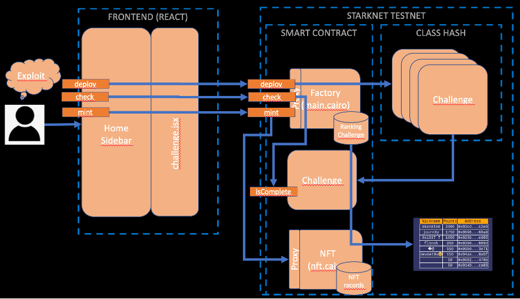

# INTRODUCTION
Starknet Security Challenges Factory is an open source platform where you can build Starknet CTFs, earn points, keep records on a leaderboard and mint nfts (worth nothing, just for fun) to challenge resolutors. You can play a live version in Sepolia network [here.](https://starknet-security-challenges.app/) 

Here you will find:

* [Requirements to install as a local CTF.](#requirements)

* [How to install in local devnet.](#how-to-install)

* [How to add challenges and contribute.](#how-to-add-a-challenge)

* [How it works in background.](#how-it-works)

# REQUIREMENTS
- scarb v2.4.3
```
curl --proto '=https' --tlsv1.2 -sSf https://docs.swmansion.com/scarb/install.sh | sh
```
- starkli 0.2.4
```
curl https://get.starkli.sh | sh
restart your shell
starkliup
```
- rust 
```
sudo curl --proto '=https' -tslv1.2 -sSf https://sh.rustup.rs | sh
```
- starknet-devnet-rs commited jan-22 or newer
```
git clone https://github.com/0xSpaceShard/starknet-devnet-rs
```
- node v19.6.1
```
sudo apt-get update
curl -fsSL https://deb.nodesource.com/setup_19.x | sudo -E bash -
sudo apt-get install -y nodejs
```
- python3.9 (optional only for cairo0 challenges support)

- cairo_lang v0.13 (optional only for cairo0 challenges support)
```
pip3 install cairo-lang
```
# HOW TO INSTALL LOCALLY
1) Start a local starknet devnet in rust instance
```
cd starknet-devnet-rs
cargo run
```
2) Create your devnet account file:
```
starkli account fetch --output ~/devnet-ssc-acct.json 0x7f8460cdc3b7b45b6d9d17c44b5e56deab0df4ab5f313930e02907d58f2a6ba --rpc http://localhost:5050
```
3) Clone repository
```
git clone https://github.com/devnet0x/Starknet-Security-Challenges-Factory
```
4) Deploy contracts to local devnet
```
cd Starknet-Security-Challenges-Factory
./install.sh
```
5) Install and run web3 platform
```
npm install
npm start run
```
6) Connect your Argentx or Braavos wallet to devnet and play at:
```
http://localhost:3000
```


# HOW TO ADD A CHALLENGE
1) Compile your Cairo challenge with a isComplete function returning true when challenge is completed.
```
scarb build
```

2) Declare your Cairo challenge in localhost devnet.
```
starkli declare --watch --rpc http://localhost:5050 --account ~/devnet-ssc-acct.json target/dev/<json contract file>
```
3) Add your challenge to main contract.
```
starkli invoke --watch --rpc http://localhost:5050 --account ~/devnet-ssc-acct.json <devnet_main_address> updateChallenge <challenge_number> <challenge_class_hash> <challenge_points>

Example:
starkli invoke --watch --rpc http://localhost:5050 --account ~/devnet-ssc-acct.json 0x02e82451d558cfeca232b490094daef0fe5148e5bb4a412e2f94aaa45c3483ba updateChallenge 8 1500 0x0649f54b81c3f5a6385f57b25db5131cece97fd92d21aa0af196eeb77b5d4c9c
```
5) Copy your new .cairo file into src/assets
6) Add your new nft image file to src/assets/nft
7) Add your new nft json file to src/assets/nft
8) Edit src/components/Challenge.jsx and add your challenge and descriptions.
9) Edit src/layout/components/menu_config.js and add your challenge to the menu.
10) Edit src/App.js and add challenge to page route.
11) Edit install.py and add your challenge in cairo1_challenge array.
12) Test your challenge in http://localhost:3000
13) Send your PR to github.

# HOW IT WORKS


1) User press deploy button in web interface.
2) Starknet-react library calls deploy function on main contract.
3) Main contract deploys a challenge instance to user.
4) User exploit and solve challenge.
5) User press check button in web interface.
6) Starknet-react library calls check function on main contract.
7) Main contract calls isComplete funcion in challenge instance.
8) If isComplete returns true then:
* Main contracts add points to user record (displayed in leaderboard).
* Mint button appears in web interface.
9) User press mint button
10) Starknet-react library calls mint function on main contract.
11) Main contract calls mint funcion in nft smart contract.
12) User can press link in web interface to watch his nft.

# HOW TO DEPLOY WEB3 PLATFORM IN PRODUCTION (ONLY PRODUCTION ADMINS).
1) Commit PR
2) Clone Repository
```
git clone https://github.com/devnet0x/Starknet-Security-Challenges-Factory
```
3) Compile challenge.
```
scarb build
```
4) Declare challenge.
```
starkli declare --watch --rpc https://starknet-sepolia.public.blastapi.io/rpc/v0_6 --account ~/sepolia-ssc-acct.json target/dev/<json contract file>
```
5) Register new challenge on main contract.
```
starkli invoke --watch --rpc https://starknet-sepolia.public.blastapi.io/rpc/v0_6 --account ~/sepolia-ssc-acct.json <sepolia_main_address> updateChallenge <challenge_number> <challenge_class_hash> <challenge_points>
```
6) Upload to test environment.
```
vercel login
vercel link (to: starknet-challenges)
vercel (if error then check node version in vercel.com project settings)
```
7) Test interface.

8) Upload to production environment.
```
vercel --prod
```

# HOW TO UPGRADE CORE CONTRACTS (ONLY PRODUCTION ADMINS)

1) Declare new main.cairo or nft.cairo smart contract.
2) Invoke upgrade
```
starkli invoke --watch --rpc https://starknet-sepolia.public.blastapi.io/rpc/v0_6 --account ~/sepolia-ssc-acct.json <sepolia_main__or_nft_address> upgrade <new_class_hash>

main contract:0x0667b3f486c25a9afc38626706fb83eabf0f8a6c8a9b7393111f63e51a6dd5dd
nft contract :0x007d85f33b50c06d050cca1889decca8a20e5e08f3546a7f010325cb06e8963f

WARNING!!! IF CLASS_HASH DOESN'T EXIST WE WILL LOST DATA AND UPGRADE FUNCTIONS.
```
